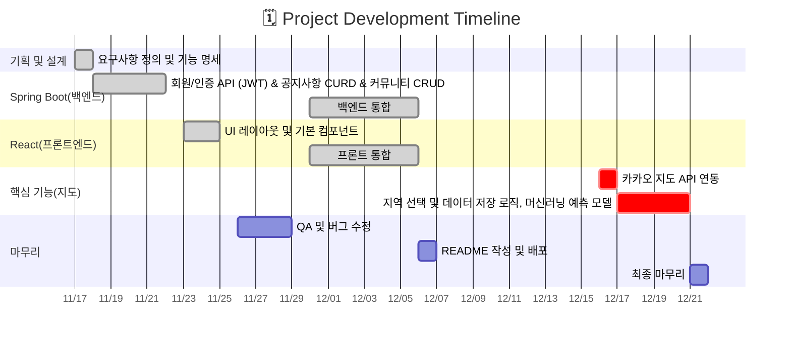

<div align="center">
    <h1>맞춤형 상권 프로젝트 『JOB-A-YO』 </h1>
</div>
<br/>
<div align="center">
    <h2>프로젝트 소개</h2>
    <p>비수도권 지역의 청년층, 중장년층을 위한 스마트한 상권 솔루션</p>
    <p>청년층에게는 비수도권지역에서 Job을 잡아 성장할 수 있는 기회 제공</p>
    <p>중장년층에게는 고향 및 비수도권 지역에서 제 2의 인생을 Job을 수 있도록 도음을 제공</p>
</div>
<br/>
<div align="center">
    <h2>팀원 소개</h2>
    <p>이미지를 누르시면 해당 팀원의 깃허브 페이지로 연결됩니다</p>
    <table>
      <thead>
        <tr align="center">
          <td>LEE SUHYEON</td>
          <td>LEE INHO</td>
          <td>LIM SAEROM</td>
        </tr>
      </thead>
      <tbody>
        <tr>
          <td><a href="https://github.com/ddaeng2001" ></a></td>
          <td><a href="https://github.com/inno-inho"></a></td>
          <td><a href="https://github.com/rombird" ></a></td>
        </tr>
        <tr align="center">
          <td>데이터분석 통합</td>
          <td>백엔드 통합</td>
          <td>프론트엔드 통합</td>
        </tr>
        <tr align="center">
          <td> 공지사항CRUD <br /> 머신러닝 구축 <br /> chart.js로 트렌드 정보 설계 </td>
          <td> 커뮤니티CRUD <br /> FastAPI로 AI 예측 리포트 설계 <br />  </td>
          <td> 유저(로그인)CRUD <br /> 상권 통계 설계 </td>
        </tr>
      </tbody>
    </table>
    
</div>
<br/>

<div align="center">
    <h2>기술 스택</h2>
    <div>
        <h3>Collaboration & Tools </h3>
          
          
          
    </div>
    <div>
        <h3>Backend</h3>
          
          
    </div>
    <div>
        <h3>Frontend</h3>
          
          
    </div>
     <div>
        <h3>Database</h3>
            
            
    </div>
    <div>
        <h3> DevOps </h3>
        <p> 배포 진행 중 ... </p>
    </div>
    
</div>

<br />

<div align="center">
    <h2>화면 구성(UI) 및 주요 기능</h2>
    <div align="left" >
        <b> ­상권 분석 예측 기능 </b> 
        <p>   머신 예측모델 구축으로 사용자가 지역, 업종을 입력하면 그에 맞는 상권을 분석해서 결과를 분석 </p>  <br />
        <b> 로그인 관련 기능 </b> 
        <p> 사용자 로그인 시 Access Token 발급, 보안 강화를 위해 Refresh Token 도입하여 Access Token 만료 시 자동 재발급 로직 구현  </p> <br/>
        <b> ­커뮤니티 & 공지사항 </b> 
        <p> RESTful API 기반의 커뮤니티/공지사항 생성·조회·수정·삭제 구현, 공지사항은 관리자('ADMIN') 권한을 가진 사용자만 작성 가능한 시스템으로 일반 사용자와 관리자 권한 분리 </p> <br />
         <table>
          <thead>
            <tr align="center">
              <td> 메인 페이지 </td>
              <td>   </td>
            </tr>
          </thead>
          <tbody>
            <tr>
                <td> AI 예측 리포트 (핵심기능) </td>
                <td>  
                    예상매출액, 창업성공확률을 머신러닝모델구축 후 FastAPI 연결 </td>
            </tr>
            <tr>
                <td> 상권 통계 </td>
                <td>   
                    업종증감률, 업종면적밀도, 점포당 유동인구로 예상 전망 등급 공식에 대입하여 분석 </td>
            </tr>
          </tbody>
        </table>
    </div>
</div>

<br />

<div align="center">
    <h2> ERD </h2>
    
</div>

<br/>

<div align="center">
    <h2>API 문서</h2>
    <table>
        <caption>사용자(User API)</caption>
        <thead>
            <tr align="center">
              <th>메서드</th>
              <th>엔드포인트(URL)</th>
              <th>설명</th>
            </tr>
        </thead>
        <tbody>
            <tr>
              <td> POST </td>
              <td> /login</td>
              <td> 로그인</td>
            </tr>
            <tr>
              <td> POST </td>
              <td> /logout </td>
              <td>로그아웃 </td>
            </tr>
            <tr>
              <td>POST</td>
              <td> /join</td>
              <td>회원가입</td>
            </tr>
            <tr>
              <td>GET</td>
              <td> /validate </td>                
              <td> 토큰 검증 </td>
            </tr>
            <tr>
              <td> PUT </td>
              <td> /user </td>                
              <td> 내 정보 수정 </td>
            </tr>
            <tr>
              <td> DELETE </td>
              <td> /user </td>                
              <td> 회원 탈퇴 </td>
            </tr>
        </tbody>
    </table>
    <br/>
    <table>
        <caption>게시판(Board API)</caption>
        <thead>
            <tr>
                <th>메서드</th>
                <th>엔드포인트(URL)</th>
                <th>설명</th>
            </tr>
        </thead>
        <tbody>
            <tr>
              <td>GET</td>
              <td>/api/board/list</td>
              <td>게시글 목록 조회</td>
            </tr>
            <tr>
              <td>GET</td>
              <td>/api/board/{id}</td>
              <td>게시글 상세조회 </td>
            </tr>
            <tr>
              <td>POST</td>
              <td>/api/board/save</td>
              <td>게시글 작성</td>
            </tr>
            <tr>
              <td>PUT</td>
              <td>/api/board/{id}</td>
              <td>게시글 수정</td>
            </tr>
            <tr>
              <td>DELETE</td>
              <td>/api/board/delete/{id}</td>
              <td>게시글 삭제</td>
            </tr>
            <tr>
              <td>GET</td>
              <td>/api/board/file/{id}</td>
              <td>파일 다운로드</td>
            </tr>
            <tr>
                <td>POST</td>
                <td>/api/comment/save</td>
                <td>댓글작성</td> 
            </tr>
        </tbody>
    </table> 
    <br/>
    <table>
        <caption> 공지사항(Notice API) </caption>
        <thead>
            <tr>
                <th>메서드</th>
                <th>엔드포인트(URL)</th>
                <th>설명</th>
            </tr>
        </thead>
        <tbody>
            <tr>
                <td> GET</td>
                <td> /api/notice/list</td>
                <td> 공지 목록</td>
            </tr>
            <tr>
                <td> GET </td>
                <td> /api/notice/{id} </td>
                <td> 공지 상세 조회 </td>
            </tr>
            <tr>
                <td> POST</td>
                <td> /api/notice/save</td>
                <td> 공지 작성</td>
            </tr>
            <tr>
                <td> PUT</td>
                <td> /api/notice/{id}</td>
                <td> 공지 수정</td>
            </tr>
            <tr>
                <td> DELETE</td>
                <td> /api/notice/delete/{id}</td>
                <td> 공지삭제</td>
            </tr>
        </tbody>
    </table>
    <br />
    <table>
        <caption> AI챗봇(Chat API) </caption>
        <thead> 
            <tr>
                <th> 메서드 </th> 
                <th> 엔드포인트(URL) </th> 
                <th> 설명 </th>
            </tr>
        </thead> 
        <tbody> 
            <tr>
                <td> POST </td>
                <td> /api/v1/simple-chat </td>
                <td> 질문하기 </td>
            </tr>
        </tbody>
    </table>
</div> 

<br />

<div align="center">
    <h2>프로젝트 구조</h2>
</div>  

```
Back
└─src
    ├─main
    │  ├─generated
    │  ├─java
    │  │  └─com
    │  │      └─example
    │  │          └─demo
    │  │              ├─apiController
    │  │              ├─config
    │  │              │  └─auth
    │  │              │      ├─exceptionHandler
    │  │              │      ├─jwt
    │  │              │      ├─loginHandler
    │  │              │      ├─logoutHandler
    │  │              │      ├─provider
    │  │              │      ├─redis
    │  │              │      └─scheduled
    │  │              ├─controller
    │  │              ├─domain
    │  │              │  ├─dto
    │  │              │  ├─entity
    │  │              │  └─repository
    │  │              └─service
    │  └─resources
    │      ├─static
    │      │  ├─css
    │      │  ├─font
    │      │  ├─image
    │      │  └─js
    │      └─templates
    │          ├─board
    │          └─user
    └─test

Front
└─src
    ├─api
    ├─assets
    ├─components
    │  ├─board
    │  ├─notice
    │  └─user
    ├─context
    ├─css
    ├─data
    ├─hooks
    ├─services
    └─utils

Ml
├─app
│  └─__pycache__
├─data
└─models
```

<br/>

<div align="center">
    <h2>설치 및 실행방법</h2>
</div>

<br />

<div align="center">
  <h2> 개발 일정 & 회고 </h2>
    <p> 프로젝트 기간 : 2025.11.18 ~ 2025.12.12(4주) </p>
    <p> 회고에 추가할 내용 : API 통신 시 ERR_NETWORK 발생 <br/>
        Spring Security 설정에서 새로운 엔드포인트(/api/stores/**)에 대한 접근 허용(permitAll)이 누락되어 요청이 차단됨. <br />
        해결 → SecurityConfig 파일의 filterChain 설정에 해당 경로를 추가하여 권한 검사 없이 접근 가능하도록 수정 후 정상 작동 확인. <br />
    </p>
</div>


