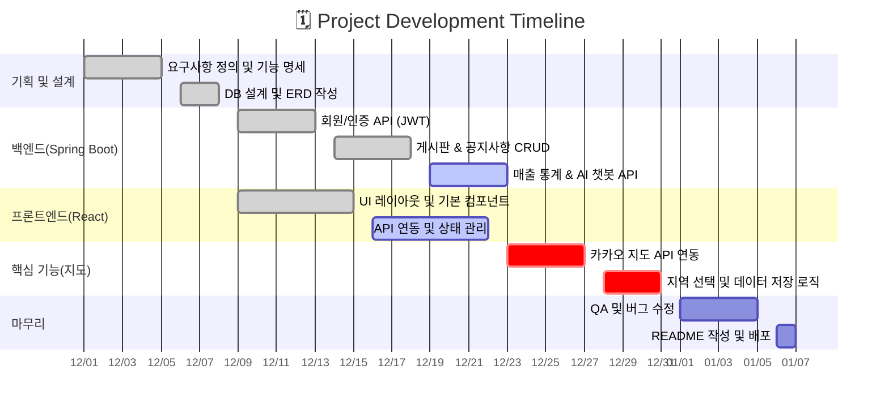

    <h1>맞춤형 상권 프로젝트 『JOB-A-YO』 </h1>

 

    <h2>프로젝트 소개</h2>
    
비수도권 지역의 청년층, 중장년층을 위한 스마트한 상권 솔루션

    
청년층에게는 비수도권지역에서 Job을 잡아 성장할 수 있는 기회 제공

    
중장년층에게는 고향 및 비수도권 지역에서 제 2의 인생을 Job을 수 있도록 도음을 제공

 

    <h2>팀원 소개</h2>
    
이미지를 누르시면 해당 팀원의 깃허브 페이지로 연결됩니다

    <table>
      <thead>
        <tr align="center">
          <td>LEE SUHYEON</td>
          <td>LEE INHO</td>
          <td>LIM SAEROM</td>
        </tr>
      </thead>
      <tbody>
        <tr>
          <td></td>
          <td></td>
          <td></td>
        </tr>
        <tr align="center">
          <td>데이터분석 통합</td>
          <td>백엔드 통합</td>
          <td>프론트엔드 통합</td>
        </tr>
        <tr align="center">
          <td>각자 작업한 내용</td>
          <td>각자 작업한 내용</td>
          <td>각자 작업한 내용</td>
        </tr>
      </tbody>
    </table>
    

 

    <h2>기술 스택</h2>
    

        <h3>Environment</h3>
          
          
          
    

    

        <h3>Development</h3>
          
          
          
          
           
          
          
          
          
          
    

    
배포시 배포환경기술까지 추가로 넣어두기

 

    <h2>주요 기능</h2>
    

        
 - 핵심 기능 : 사용자가 원하는 소비층, 원하는 지역 등을 입력하면 그에 맞는 상권을 분석해서 결과를 예측 or 비슷한 다른 조건들을 추천해주는 시스템 → 고객 맞춤형 보고서 제공
        
 - 필수 기능 : 회원/인증, 게시판/공지사항, AI 챗봇 chart.js

    

 

    <h2>화면구성(UI)</h2>
    
 gif로 핵심기능 찍으면 좋음 

 

    <h2> ERD </h2>

 

    <h2>API 문서</h2>
    <table>
        <caption>사용자(User API)</caption>
        <thead>
            <tr align="center">
              <th>메서드</th>
              <th>엔드포인트(URL)</th>
              <th>설명</th>
            </tr>
        </thead>
        <tbody>
            <tr>
              <td> POST </td>
              <td> /login</td>
              <td> 로그인</td>
            </tr>
            <tr>
              <td> POST </td>
              <td> /logout </td>
              <td>로그아웃 </td>
            </tr>
            <tr>
              <td>POST</td>
              <td> /join</td>
              <td>회원가입</td>
            </tr>
            <tr>
              <td>GET</td>
              <td> /validate </td>                
              <td> 토큰 검증 </td>
            </tr>
            <tr>
              <td> PUT </td>
              <td> /user </td>                
              <td> 내 정보 수정 </td>
            </tr>
            <tr>
              <td> DELETE </td>
              <td> /user </td>                
              <td> 회원 탈퇴 </td>
            </tr>
        </tbody>
    </table>
     
    <table>
        <caption>게시판(Board API)</caption>
        <thead>
            <tr>
                <th>메서드</th>
                <th>엔드포인트(URL)</th>
                <th>설명</th>
            </tr>
        </thead>
        <tbody>
            <tr>
              <td>GET</td>
              <td>/api/board/list</td>
              <td>게시글 목록 조회</td>
            </tr>
            <tr>
              <td>GET</td>
              <td>/api/board/{id}</td>
              <td>게시글 상세조회 </td>
            </tr>
            <tr>
              <td>POST</td>
              <td>/api/board/save</td>
              <td>게시글 작성</td>
            </tr>
            <tr>
              <td>PUT</td>
              <td>/api/board/{id}</td>
              <td>게시글 수정</td>
            </tr>
            <tr>
              <td>DELETE</td>
              <td>/api/board/delete/{id}</td>
              <td>게시글 삭제</td>
            </tr>
            <tr>
              <td>GET</td>
              <td>/api/board/file/{id}</td>
              <td>파일 다운로드</td>
            </tr>
            <tr>
                <td>POST</td>
                <td>/api/comment/save</td>
                <td>댓글작성</td> 
            </tr>
        </tbody>
    </table> 
     
    <table>
        <caption> 공지사항(Notice API) </caption>
        <thead>
            <tr>
                <th>메서드</th>
                <th>엔드포인트(URL)</th>
                <th>설명</th>
            </tr>
        </thead>
        <tbody>
            <tr>
                <td> GET</td>
                <td> /api/notice/list</td>
                <td> 공지 목록</td>
            </tr>
            <tr>
                <td> GET </td>
                <td> /api/notice/{id} </td>
                <td> 공지 상세 조회 </td>
            </tr>
            <tr>
                <td> POST</td>
                <td> /api/notice/save</td>
                <td> 공지 작성</td>
            </tr>
            <tr>
                <td> PUT</td>
                <td> /api/notice/{id}</td>
                <td> 공지 수정</td>
            </tr>
            <tr>
                <td> DELETE</td>
                <td> /api/notice/delete/{id}</td>
                <td> 공지삭제</td>
            </tr>
        </tbody>
    </table>
     
    <table>
        <caption> AI챗봇(Chat API) </caption>
        <thead> 
            <tr>
                <th> 메서드 </th> 
                <th> 엔드포인트(URL) </th> 
                <th> 설명 </th>
            </tr>
        </thead> 
        <tbody> 
            <tr>
                <td> POST </td>
                <td> /api/v1/simple-chat </td>
                <td> 질문하기 </td>
            </tr>
        </tbody>
    </table>

 

 

    <h2>프로젝트 구조</h2>
    
tree .

 

    <h2>설치 및 실행방법</h2>

  <h2> 개발 일정 & 회고 </h2>
    
 프로젝트 기간 : 2025.11.18 ~ 2025.12.12(4주) 

    
 회고에 추가할 내용 : API 통신 시 ERR_NETWORK 발생  
        문제: 리액트에서 백엔드로 점포 수 조회 요청 시 AxiosError: Network Error 발생.  
        원인: Spring Security 설정에서 새로운 엔드포인트(/api/stores/**)에 대한 접근 허용(permitAll)이 누락되어 요청이 차단됨.  
        해결: SecurityConfig 파일의 filterChain 설정에 해당 경로를 추가하여 권한 검사 없이 접근 가능하도록 수정 후 정상 작동 확인.  
    

